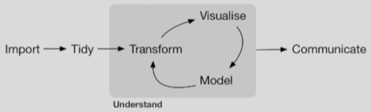

Essential R concepts and tidyverse programming paradigm.

## Basic Data Types

### Numeric data

Integers or floating-point numbers

### Character data

Strings

### Logical data

Booleans

### Factor data

Looks like a string but underneath it's an integer.

Conceptually similar to an enum.

Used to represent categorical data.

Map labels to "levels".

|         |         |             |             |
|---------|---------|-------------|-------------|
| Labels: | Placebo | Treatment 1 | Treatment 2 |
| Levels  | 1       | 2           | 3           |

## Data Structures

### Vectors

Ordered set of items with the same type.

``` r
c(1, 2, 3, 4, 5)
```

`c()` is the combine or concatenate function,

Elements are accessed via a 1-based indices.

```{r}
vec <- c(1, 2, 3, 4, 5)
vec[1]
```

### Matrices

2-dimensional *numerical* data.

*Column major order*

```{r}
mat <- matrix(1:9, nrow = 3, ncol = 3)
mat
```

### Arrays

Higher-dimensional *numerical* data structure.

Column, row, z

``` r
array()
```

### Lists

Lists allow for storing different data types in the same structure.

Elements can be accessed via indices or key/value pairs.

```{r}
print("indices")

list1 <- list(37, 3.14, "Bob")

list1[1]
list1[2]
list1[3]
list1[1 + 1]

print("key/value pairs")

list2 <- list(
  "age" = 37,
  "pi" = 3.14,
  "name" = "Bob"
)

list2["name"]
list2[3]
list2$name
```

### DataFrames

DataFrames have the same shape as matrices but each column can be of a different data type.

```{r}
df <- data.frame(
  names = c("Frodo", "Sam", "Pippin", "Merry"),
  values = c(37, 42, 59, 8)
)

df
```

### Tibbles

The tidyverse uses [Tibbles](https://tibble.tidyverse.org/) instead of DataFrames.

Tibbles are enhanced DataFrames.

> A tibble, or `tbl_df`, is a modern reimagining of the data.frame, keeping what time has proven to be effective, and throwing out what is not. Tibbles are data.frames that are lazy and surly: they do less (i.e. they don’t change variable names or types, and don’t do partial matching) and complain more (e.g. when a variable does not exist). This forces you to confront problems earlier, typically leading to cleaner, more expressive code. Tibbles also have an enhanced `print()` method which makes them easier to use with large datasets containing complex objects.
>
> If you are new to tibbles, the best place to start is the [tibbles chapter](https://r4ds.had.co.nz/tibbles.html) in R for data science.

```{r}
pacman::p_load("tidyverse")

df <- tibble(
  names = c("Frodo", "Sam", "Pippin", "Merry"),
  values = c(37, 42, 59, 8)
)

df
```

## Iteration

-   `for` loops: useful when you know how many times you need to iterate
-   `while` loops: useful when you don's or can't know how many times you will need to iterate (such as when performing an optimization)

`while` loops execute while some condition holds true.

```{r}
counter <- 1

while (counter <= 10) {
  print(counter)
  counter <- counter + 1
}
```

`for` loops execute the same code over every element of a given set.

```{r}
for (number in 1:10) {
  print(number)
}
```

You will often store intermediate results in another data structure.

```{r}
cumulative_sums <- c()
running_total <- 0
for (number in 1:10) {
  running_total <- running_total + number
  cumulative_sums <- c(cumulative_sums, running_total)
}
print(cumulative_sums)
```

`for` and `while` come in "base R." There are packages that add additional looping structures, such as [foreach](https://cran.r-project.org/web/packages/foreach/vignettes/foreach.html).

## Control Flow

``` r
if (condition) {
  statement(s)
}

if (condition) {
  statement(s)
} else if {
  statement(s)
}

if (condition) {
  statement(s)
} else {
  statement(s)
}
```

## Functions

Reusable code.

``` r
analyze_data <- function(data) {
  grp1_data = data$grp1
  grp2_data = data$grp2
  
  ttest = t.test(grp1_data, grp2_data)
  grp1_mean = mean(grp1_data)
  grp2_mean = mean(grp2_data)
  
  was_significant = ttest["pvalue"] < 0.05
  
  return(list(grp1_mean, grp2_mean, was_significant))
}

results = analyze_data(new_data)
```

### R's built-in functions

Not surprisingly, R has many ready-to-use functions for common statistical procedures. For example:

-   `lm` performs linear regression
-   `glm` lets us create generalized linear models

## Packages & Libraries

Reusable code libraries.

The [Comprehensive R Archive Network CRAN](https://cran.r-project.org/).

`install.packages("name")` to install the package on your system

`library("name")` to import the package into your project

`pacman` to do it all ;)

Also, `devtools::install_github("name")` to install from GitHub rather than CRAN.

## Tidyverse

The tidyverse package is a set of 9 actual packages which change the base R paradigm to an extent. It contains pretty much all the functionality you need for doing statistics and data science quickly and reproducibly.

#### `readr`

The goal of readr is to provide a fast and friendly way to read rectangular data from delimited files, such as comma-separated values (CSV) and tab-separated values (TSV). It is designed to parse many types of data found in the wild, while providing an informative problem report when parsing leads to unexpected results. If you are new to readr, the best place to start is the [data import chapter](https://r4ds.had.co.nz/data-import.html) in R for Data Science.

#### `tibble`

A tibble, or tbl_df, is a modern reimagining of the data.frame, keeping what time has proven to be effective, and throwing out what is not. Tibbles are data.frames that are lazy and surly: they do less (i.e. they don’t change variable names or types, and don’t do partial matching) and complain more (e.g. when a variable does not exist). This forces you to confront problems earlier, typically leading to cleaner, more expressive code. Tibbles also have an enhanced [`print()`](https://rdrr.io/r/base/print.html) method which makes them easier to use with large datasets containing complex objects.

If you are new to tibbles, the best place to start is the [tibbles chapter](https://r4ds.had.co.nz/tibbles.html) in R for data science.

#### `dplyr`

dplyr is a grammar of data manipulation, providing a consistent set of verbs that help you solve the most common data manipulation challenges:

-   `mutate()` adds new variables that are functions of existing variables.
-   `select()` picks variables based on their names.
-   `filter()` picks cases based on their values.
-   `summarise()` reduces multiple values down to a single summary.
-   `arrange()` changes the ordering of the rows.

These all combine naturally with [`group_by()`](https://dplyr.tidyverse.org/reference/group_by.html) which allows you to perform any operation “by group”. You can learn more about them in [`vignette("dplyr")`](https://dplyr.tidyverse.org/articles/dplyr.html). As well as these single-table verbs, dplyr also provides a variety of two-table verbs, which you can learn about in [`vignette("two-table")`](https://dplyr.tidyverse.org/articles/two-table.html). \> \> If you are new to dplyr, the best place to start is the [data transformation chapter](https://r4ds.hadley.nz/data-transform) in R for Data Science.

#### `lubridate`

Date-time data can be frustrating to work with in R. R commands for date-times are generally unintuitive and change depending on the type of date-time object being used. Moreover, the methods we use with date-times must be robust to time zones, leap days, daylight savings times, and other time related quirks, and R lacks these capabilities in some situations. Lubridate makes it easier to do the things R does with date-times and possible to do the things R does not.

If you are new to lubridate, the best place to start is the [date and times chapter](https://r4ds.had.co.nz/dates-and-times.html) in R for data science.

#### `stringr`

Strings are not glamorous, high-profile components of R, but they do play a big role in many data cleaning and preparation tasks. The stringr package provides a cohesive set of functions designed to make working with strings as easy as possible. If you’re not familiar with strings, the best place to start is the [chapter on strings](https://r4ds.hadley.nz/strings) in R for Data Science.

stringr is built on top of [stringi](https://github.com/gagolews/stringi), which uses the [ICU](https://icu.unicode.org/) C library to provide fast, correct implementations of common string manipulations. stringr focusses on the most important and commonly used string manipulation functions whereas stringi provides a comprehensive set covering almost anything you can imagine. If you find that stringr is missing a function that you need, try looking in stringi. Both packages share similar conventions, so once you’ve mastered stringr, you should find stringi similarly easy to use.

#### `forcats`

R uses **factors** to handle categorical variables, variables that have a fixed and known set of possible values. Factors are also helpful for reordering character vectors to improve display. The goal of the **forcats** package is to provide a suite of tools that solve common problems with factors, including changing the order of levels or the values. Some examples include:

-   `fct_reorder()`: Reordering a factor by another variable.
-   `fct_infreq()`: Reordering a factor by the frequency of values.
-   `fct_relevel()`: Changing the order of a factor by hand.
-   `fct_lump()`: Collapsing the least/most frequent values of a factor into “other”.

You can learn more about each of these in [`vignette("forcats")`](https://forcats.tidyverse.org/articles/forcats.html). If you’re new to factors, the best place to start is the [chapter on factors](https://r4ds.hadley.nz/factors.html) in R for Data Science.

#### `tidyr`

The goal of tidyr is to help you create **tidy data**. Tidy data is data where:

1.  Every column is a variable.
2.  Every row is an observation.
3.  Every cell is a single value.

Tidy data describes a standard way of storing data that is used wherever possible throughout the [tidyverse.](https://www.tidyverse.org/) If you ensure that your data is tidy, you’ll spend less time fighting with the tools and more time working on your analysis. Learn more about tidy data in [`vignette("tidy-data")`](https://tidyr.tidyverse.org/articles/tidy-data.html).

#### `purr`

purrr enhances R’s functional programming (FP) toolkit by providing a complete and consistent set of tools for working with functions and vectors. If you’ve never heard of FP before, the best place to start is the family of [`map()`](https://purrr.tidyverse.org/reference/map.html) functions which allow you to replace many for loops with code that is both more succinct and easier to read. The best place to learn about the [`map()`](https://purrr.tidyverse.org/reference/map.html) functions is the [iteration chapter](https://r4ds.had.co.nz/iteration.html) in R for data science.

#### `ggplot`

ggplot2 is a system for declaratively creating graphics, based on [The Grammar of Graphics](https://www.amazon.com/Grammar-Graphics-Statistics-Computing/dp/0387245448/ref=as_li_ss_tl). You provide the data, tell ggplot2 how to map variables to aesthetics, what graphical primitives to use, and it takes care of the details.

## Data science workflow



### Loading the data

`readr` is often used here.

``` r
library("tidyverse")

data <- read_csv("secret_data.csv")
data <- read_tsv("secret_data.tsv")
data <- read_delim("secret_data.csv", delim = ";)
```

#### tidyverse-adjacent packages

`readxl` for reading Excel files (not part of the standard tidyverse package).

``` r
library("readxl")

data <- read_xlsx("secret_data.xlsx")
```

These libraries read data into **tibles** as defined in the `tibble` package.

## The pipe operator

tidyverse is useful because it enables you to write clear, self-contained pipelines that cover the entire data science workflow.

The pipe operator (`%>%`) allows you to pipe the output of one function into another.

Almost all function in the tidyverse take in a tibble and produce a tibble.

Two versions of the pipe operator that can be used in the tidyverse:

-   `%>%` (older, from `magrittr` package)
-   `|>` (from base R)

``` r
library("tidyverse")

df = read_csv("secret_data.csv") %>%
  select(column1, column2, column3) %>%
  filter(column1 > 42)
```

### Tidying & transformation

It's rare that data is immediately useful after being loaded.

#### `select()`

Provides many of the functions needed for cleaning data.

``` r
# select() lets us choose the columns we want to keep
tidy_df <- df %>%
  select(col1, col2, col3)  # dropping any other columns
```

#### `filter()`

``` r
# filter() lets us choose the rows we want to keep
tidy_df <- df %>%
  filter(col2 == "B")
```

#### mutate()

``` r
# mutate() lets us create new columns
tidy_df <- df %>%
  mutate(col5 <- col1 + 5)
```

### Working with strings

`stringr` specializes in working with strings.

### Working with dates and times

`lubridate` specializes in working with dates and times.

### Working with factor data

`forcats` is designed to work on factor data.

### List-columns

Normally, columns in a tibble are vectors.

| Col1 | Col2 | Col3  | Col4  |
|------|------|-------|-------|
| 1    | A    | TRUE  | Ana   |
| 2    | A    | FALSE | Bob   |
| 3    | B    | FALSE | Chris |
| 4    | B    | TRUE  | Dawn  |
| 5    | B    | TRUE  | EJ    |

``` r
df %>% pull(col1)

[1] 1 2 3 4 5
```

We can also store lists in a given column. Columns that contain lists are called list-columns. This allows each cell in the column to contain heterogeneous data.

| Col1 | Col2 | Col3  | Col4  | Col5          |
|------|------|-------|-------|---------------|
| 1    | A    | TRUE  | Ana   | c(1, 2, 3)    |
| 2    | A    | FALSE | Bob   | c(4, 5, 6)    |
| 3    | B    | FALSE | Chris | c(7, 8, 9)    |
| 4    | B    | TRUE  | Dawn  | c(10, 11, 12) |
| 5    | B    | TRUE  | EJ    | c(13, 14, 15) |

Being able to store lists in a column is handy for simulations, for example. We can create simulated data sets and store each in a cell in the tibble. Using `mutate()` we can add a column to the table that analyzes the data in each row with a statistical model.

### The purr package

`purr` gives us functions for working with list-columns. These functions all start with `map`. The output of a `map` function is a list-column.

### Wide and long data

Wide data has more columns than rows and is easier for humans to read.

Long data has more rows than columns and is better suited for the computer.
